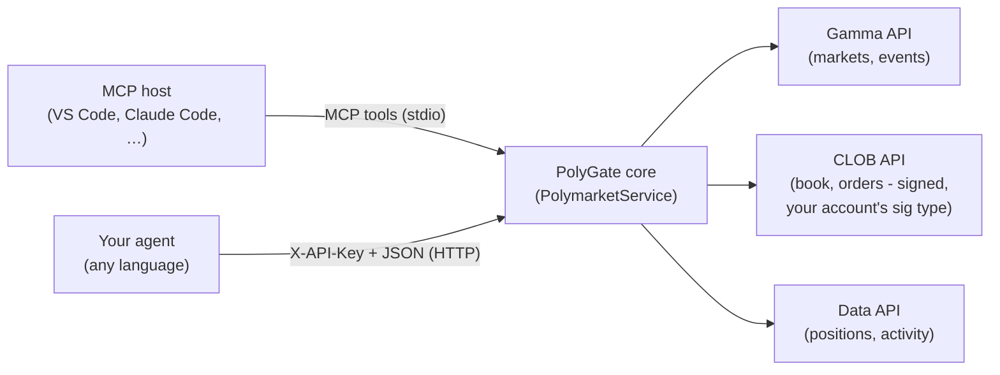

# PolyGate

**PolyGate** puts Polymarket's Gamma, CLOB, and Data APIs behind one small core
service, exposed through two thin adapters so any agent can research markets and
trade on [Polymarket](https://polymarket.com) without wrestling with SDKs, order
signing, or on-chain plumbing:

- a **REST gateway** (FastAPI) your agent drives over HTTP in **any language**, and
- an **MCP server** that drops the same capabilities straight into MCP-capable AI
  hosts (VS Code, Claude Code, Claude Desktop, Cursor, OpenClaw, …) as tools — no
  HTTP server, port, or API key for the agent to manage.

Both adapters are thin shells over the same in-process core
(`PolymarketService`), so they expose identical capabilities and behave the same
way — pick whichever your agent speaks. The core owns all upstream access, order
signing, and the dry-run safety switch; the adapters only translate transports.

- **Works with your Polymarket account** - email/Google sign-up (proxy wallet), a
  connected browser wallet (Gnosis Safe), a deposit wallet, or a plain EOA.
  PolyGate detects the right order **signature type** for you at startup.
- **Polymarket-native** - no on-chain setup, no token allowances, no separate RPC.
  Fund your account on polymarket.com and trade; all orders, fills, and history
  show up on your normal Polymarket account.


## How it works



Trading on Polymarket involves two addresses, and you provide both:

- **Your wallet** (`PRIVATE_KEY`) - an ordinary Ethereum keypair (often called an
  *EOA*, "externally owned account") whose private key **signs** your orders. If
  you created your account on polymarket.com, this is the key it reveals under
  **Settings → Account → Private Key** - that is your signer, no MetaMask needed.
  If you instead connected your own wallet, export *its* private key. Either way
  you do not need a new wallet.
- **Your funding wallet** (`FUNDER_ADDRESS`) - the Polymarket account that
  actually **holds your USDC** and is the order maker. Your orders are
  signed by your wallet above with this address as the maker, using the signature
  type PolyGate detects. You never get a separate key for it; your wallet above
  controls it.

This service only **reads market/account data** and **places/cancels orders**. It does not manage your wallet, does not handle deposits or withdrawals, and does not sign any transactions other than orders, and does not provide any algorithmic trading logic. It is a thin, secure, abstraction layer on top of Polymarket's APIs so you can build your own trading agent in any language.

## Setup

### 1. Get the code and install

Requires Python 3.11+.

```bash
git clone https://github.com/ilmari99/polygate.git
cd polygate
python -m venv .venv && source .venv/bin/activate
pip install .
```

This installs the service and the `polygate` server command.

> **Prefer [uv](https://docs.astral.sh/uv/)?** You can skip the manual
> virtual-environment and Python management entirely. From the cloned repo,
> `uv run polygate` provisions an isolated environment and starts the server in
> one step. To run it without cloning, use
> `uvx --from git+https://github.com/ilmari99/polygate polygate`.

### 2. Configure your account

You need two things from your Polymarket account:

- **`PRIVATE_KEY`** - your signer key. On polymarket.com, open
  **Settings → Account → Private Key** and reveal it. (If you connected your own
  wallet such as MetaMask instead of signing up directly, export the key from that
  wallet instead.) **Keep it secret.**
- **`FUNDER_ADDRESS`** - the address that holds your funds and is the order maker, shown on polymarket.com under
  **Settings → Profile → Address**.

There are two ways to provide them:

- **In your browser (no file editing).** Start the server (step 3) and open
  **http://127.0.0.1:8000/setup**. PolyGate runs unconfigured until you do this:
  paste the two values into the local page and submit. The page is served only
  to the local machine and only while no wallet is configured; your keys are
  written to `.env` on this machine and never leave it.
- **By editing `.env`.** Copy [.env.example](.env.example) to `.env` and fill in
  `PRIVATE_KEY` and `FUNDER_ADDRESS` before starting.

Either way, that is all you provide. On first start (or right after you submit
the setup page) PolyGate **generates a `PLATFORM_API_KEY`**, **derives the CLOB
credentials from your wallet key**, and **detects your order `SIGNATURE_TYPE`**
from which maker holds your funds, saving them all back to `.env`. Read the
generated `PLATFORM_API_KEY` from `.env` to call the protected endpoints.

### 3. Run

```bash
polygate        # or: uv run polygate
```

The API listens on `http://127.0.0.1:8000`, with interactive docs at
`http://127.0.0.1:8000/docs`. If you have not added your keys yet, open
`http://127.0.0.1:8000/setup` to connect your account. Orders are **real** once
a wallet is configured and your account is funded.

## Configuration

All configuration is environment-driven; see [.env.example](.env.example).

| Variable           | Required | Description                                                              |
| ------------------ | :------: | ------------------------------------------------------------------------ |
| `PRIVATE_KEY`      |   yes    | Private key of the wallet that signs your orders. **Keep secret.**       |
| `FUNDER_ADDRESS`   |   yes    | The address that holds your funds and makes your orders (proxy or deposit wallet). |
| `PLATFORM_API_KEY` |   auto   | Shared secret for this REST API, sent as the `X-API-Key` header. Generated on first start. |
| `CLOB_API_KEY`     |   auto   | Auto-derived from your wallet key at startup.                            |
| `CLOB_SECRET`      |   auto   | Auto-derived from your wallet key at startup.                            |
| `CLOB_PASSPHRASE`  |   auto   | Auto-derived from your wallet key at startup.                            |
| `SIGNATURE_TYPE`   |   auto   | Order signature type (`0`-`3`). Auto-detected at startup; set to override. |
| `HOST` / `PORT`    |    no    | Server bind address (default `127.0.0.1:8000`).                          |
| `LOG_LEVEL`        |    no    | Logging level (default `INFO`).                                          |

The server starts without a wallet and serves the local `/setup` page until you
add one (`PRIVATE_KEY` + `FUNDER_ADDRESS`); account and trading endpoints become
active as soon as it is configured. The `PLATFORM_API_KEY` that protects the
account endpoints, the CLOB credentials, and your order signature type are all
generated or detected automatically and saved to `.env`.

## Using the API

A trading agent drives everything over HTTP. The flow is always the same: read
market data, decide, then place orders.

### Authentication

Public **market-data** and **research** endpoints (markets, events, order book,
prices, search, comments, holders) need no credentials. Endpoints that touch your
**account** - the whole `/portfolio` group, the `/orders` and `/trades` listings,
the trading actions, and `/config` - require your platform secret in the
`X-API-Key` header. `GET /health` is always public.

```bash
# public - no key needed
curl -s localhost:8000/markets

# account - key required
curl -s localhost:8000/portfolio/positions -H "X-API-Key: $PLATFORM_API_KEY"
```

### Response shape

**Data endpoints** wrap their payload so your agent can reason about staleness -
it, not the platform, controls the polling frequency:

```json
{
  "data": { "...": "upstream payload" },
  "fetched_at": "2026-06-15T12:00:00Z",
  "source": "gamma"
}
```

**Action endpoints** (`POST /orders`, cancels) return the result directly, e.g.:

```json
{ "simulated": false, "success": true, "order_id": "0xabc...", "status": "matched" }
```

Errors always come back as `{ "error": "<code>", "detail": "<message>" }` with an
appropriate HTTP status.

### A typical agent loop

1. `GET /markets?active=true&closed=false` - find a market; read its
   `clobTokenIds` (a JSON array of the Yes/No outcome token ids).
2. `GET /midpoint/{token_id}` (or `/orderbook/{token_id}`, `/price/{token_id}`) -
   read the current market for the outcome you care about.
3. Decide your price and size.
4. `POST /orders` - place the order.
5. `GET /orders?market={condition_id}` and `GET /trades` - track open orders and
   fills; `GET /portfolio/positions` and `/portfolio/value` for your book.

[examples/sample_agent.py](examples/sample_agent.py) is a runnable, dependency-free
reference implementation of exactly this loop.

### Placing an order

```bash
curl -s -X POST localhost:8000/orders \
  -H "X-API-Key: $PLATFORM_API_KEY" -H "Content-Type: application/json" \
  -d '{
    "token_id": "713210456792522125946263855327069127503327285719425322896313793124555839925",
    "side": "BUY",
    "size": 5,
    "price": 0.42,
    "order_type": "GTC"
  }'
```

| Field        | Required | Notes                                                              |
| ------------ | :------: | ------------------------------------------------------------------ |
| `token_id`   |   yes    | CLOB token id of the outcome (Yes or No), from `clobTokenIds`.     |
| `side`       |   yes    | `BUY` or `SELL`.                                                    |
| `size`       |   yes    | Number of outcome shares (> 0).                                    |
| `price`      | for GTC/GTD | Limit price in `(0, 1)`. Also required for `FOK`/`FAK`.         |
| `order_type` |    no    | `GTC` (default), `GTD`, `FOK`, `FAK` (see below).                  |
| `expiration` | for GTD  | Unix seconds.                                                      |
| `tick_size`  |    no    | Auto-detected from the market if omitted.                          |
| `neg_risk`   |    no    | Auto-detected from the market if omitted.                          |

Order types: `GTC` good-til-cancelled limit, `GTD` good-til-date (needs
`expiration`), `FOK` fill-or-kill, `FAK` fill-and-kill. `FOK`/`FAK` are
marketable orders and still need an explicit limit `price`.

## API reference

Market-data and research endpoints are public. Portfolio, trading, and `/config`
require `X-API-Key`; `GET /health` is always public.

### System
| Method | Path      | Description                          |
| ------ | --------- | ------------------------------------ |
| GET    | `/health` | Liveness + status (no auth).         |
| GET    | `/config` | Secret-free configuration summary.   |

### Market data
| Method | Path                          | Description                       |
| ------ | ----------------------------- | --------------------------------- |
| GET    | `/markets`                    | List markets (filters + `slug`).  |
| GET    | `/markets/{condition_id}`     | Single market.                    |
| GET    | `/events`                     | List events.                      |
| GET    | `/tags`                       | List tags.                        |
| GET    | `/orderbook/{token_id}`       | Full CLOB order book.             |
| GET    | `/price/{token_id}`           | Best book price per side: `?side=BUY` = best **bid**, `?side=SELL` = best **ask**. |
| GET    | `/midpoint/{token_id}`        | Order-book midpoint.              |
| GET    | `/spread/{token_id}`          | Bid/ask spread.                   |
| GET    | `/last-trade-price/{token_id}`| Last traded price.                |
| GET    | `/prices-history/{token_id}`  | Historical prices.                |

### Research
| Method | Path                        | Description                                      |
| ------ | --------------------------- | ------------------------------------------------ |
| GET    | `/search`                   | Full-text search over events/markets (`?q=`).    |
| GET    | `/comments`                 | Event comments (`?event_id=` numeric event id).  |
| GET    | `/holders/{condition_id}`   | Top holders per outcome token.                   |

### Portfolio
| Method | Path                   | Description                                 |
| ------ | ---------------------- | ------------------------------------------- |
| GET    | `/portfolio/positions` | Open positions (Data API).                  |
| GET    | `/portfolio/value`     | Current portfolio value.                    |
| GET    | `/portfolio/balance`   | Collateral or token balance (`?token_id=`). |
| GET    | `/activity`            | Account activity feed.                      |
| GET    | `/orders`              | Open orders (`?market=` / `?asset_id=`).    |
| GET    | `/trades`              | Trade history.                              |

### Trading
| Method | Path                        | Description             |
| ------ | --------------------------- | ----------------------- |
| POST   | `/orders`                   | Place an order.         |
| POST   | `/orders/cancel-all`        | Cancel all open orders. |
| POST   | `/orders/{order_id}/cancel` | Cancel one order.       |

## Use as an MCP server (any AI app)

PolyGate also ships an [MCP](https://modelcontextprotocol.io) server, so any
MCP-capable host (Claude Desktop, VS Code, Cursor, your own agent, …) can use
Polymarket directly - no HTTP server, port, or `PLATFORM_API_KEY` to manage. The
host launches `polygate-mcp` over stdio and gets every gateway capability as MCP
**tools** (markets, order book, prices, search, holders, positions, balance, and
placing/cancelling orders).

The server talks to the `PolymarketService` in-process, so it derives your CLOB
credentials and detects your signature type fresh in memory at startup and never
writes them to disk.

### Run it with `uvx` (no install)

With [uv](https://docs.astral.sh/uv/) installed, no cloning or install step is
needed - `uvx` fetches and launches `polygate-mcp` on demand. Point `--from` at
either a pinned git ref or a **local checkout**:

```bash
# from a pinned git release
uvx --from git+https://github.com/ilmari99/polygate@v0.2.0 polygate-mcp

# from a local clone (use this while developing PolyGate itself)
uvx --from /path/to/polygate polygate-mcp
```

Every example below uses that same command and passes your wallet via the host's
`env`. Swap the git URL for a local path anywhere if you prefer to run your own
checkout.

### VS Code (Copilot agent mode)

Create `.vscode/mcp.json` in your workspace. VS Code uses the `servers` key (not
`mcpServers`) and a `type` field:

```json
{
  "servers": {
    "polygate": {
      "type": "stdio",
      "command": "uvx",
      "args": ["--from", "git+https://github.com/ilmari99/polygate@v0.2.0", "polygate-mcp"],
      "env": {
        "FUNDER_ADDRESS": "0xYourFundingAddress",
        "PRIVATE_KEY": "0xYourSignerPrivateKey"
      }
    }
  }
}
```

Reload the window; the tools appear in the agent's tool picker. (Prefer not to
commit secrets? Use VS Code input variables, or set `PRIVATE_KEY` in your
environment and drop it from `env`.)

### Claude Code

Add it from the CLI (`--` separates Claude's flags from the server command):

```bash
claude mcp add polygate \
  --env FUNDER_ADDRESS=0xYourFundingAddress \
  --env PRIVATE_KEY=0xYourSignerPrivateKey \
  -- uvx --from git+https://github.com/ilmari99/polygate@v0.2.0 polygate-mcp
```

Or share it with a repo by committing a project-scoped `.mcp.json` (uses the
`mcpServers` key; `${VAR}` expands from your environment so no secret is stored):

```json
{
  "mcpServers": {
    "polygate": {
      "command": "uvx",
      "args": ["--from", "git+https://github.com/ilmari99/polygate@v0.2.0", "polygate-mcp"],
      "env": {
        "FUNDER_ADDRESS": "${FUNDER_ADDRESS}",
        "PRIVATE_KEY": "${PRIVATE_KEY}"
      }
    }
  }
}
```

### OpenClaw

Add an `mcp.servers` entry to `~/.openclaw/openclaw.json` (JSON5; the gateway
hot-reloads it). `${VAR}` reads from your environment, so keep keys out of the
file:

```json5
{
  mcp: {
    servers: {
      polygate: {
        command: "uvx",
        args: ["--from", "git+https://github.com/ilmari99/polygate@v0.2.0", "polygate-mcp"],
        env: {
          FUNDER_ADDRESS: "${FUNDER_ADDRESS}",
          PRIVATE_KEY: "${PRIVATE_KEY}",
        },
      },
    },
  },
}
```

PolyGate's tools then load under the `bundle-mcp` plugin id; allow them in
`tools.*` policy if you restrict tools per agent.

### Other hosts (Claude Desktop, Cursor, …)

Most hosts use the standard `mcpServers` stdio shape:

```json
{
  "mcpServers": {
    "polygate": {
      "command": "uvx",
      "args": ["--from", "git+https://github.com/ilmari99/polygate@v0.2.0", "polygate-mcp"],
      "env": {
        "FUNDER_ADDRESS": "0xYourFundingAddress",
        "PRIVATE_KEY": "0xYourSignerPrivateKey"
      }
    }
  }
}
```

> Want the model to know *how to trade* before it starts? Hand it
> [`llm.md`](llm.md) - an optional briefing on reading Polymarket via these tools
> and keeping a persistent memory of what it learns.

### Environment

The server reads the same wallet credentials as the REST gateway:

| Variable          | Required | Description                                              |
| ----------------- | :------: | -------------------------------------------------------- |
| `PRIVATE_KEY`     | for trading | Signer key. **Keep secret.** Provide via the host's `env`. |
| `FUNDER_ADDRESS`  | for trading | The address that holds your funds and makes your orders. |
| `DRY_RUN`         |    no    | `true` simulates orders without signing or sending them. |
| `SIGNATURE_TYPE`, `CLOB_API_KEY`, … |   auto   | Derived/detected in memory at startup; set only to override. |

Market-data and research tools (`list_markets`, `get_order_book`, `get_price`,
`search`, `get_holders`, …) work **without a wallet**. Account and trading tools
(`get_positions`, `get_balance`, `place_order`, `cancel_order`, …) require the
two wallet values above. Use `DRY_RUN=true` to exercise `place_order` safely.

> Stdio transport note: the server logs only to **stderr** and keeps stdout
> reserved for the MCP protocol, as the spec requires.

## Development

```bash
pip install ".[dev]"
pytest -q
```

The suite runs fully offline (HTTP is mocked). Tests exercise a `DRY_RUN`
developer switch that simulates orders without signing or sending them; it is a
testing aid and off by default.

## Safety

- Treat `.env` as a credential. It is gitignored; keep it `chmod 600` and back up
  your `PRIVATE_KEY`. Losing it loses access to the account; leaking it risks your
  funds.
- The REST API is only as private as `PLATFORM_API_KEY`. Bind to `127.0.0.1`
  (the default) unless you front it with TLS and proper auth.

## License

MIT - see [LICENSE](LICENSE).
