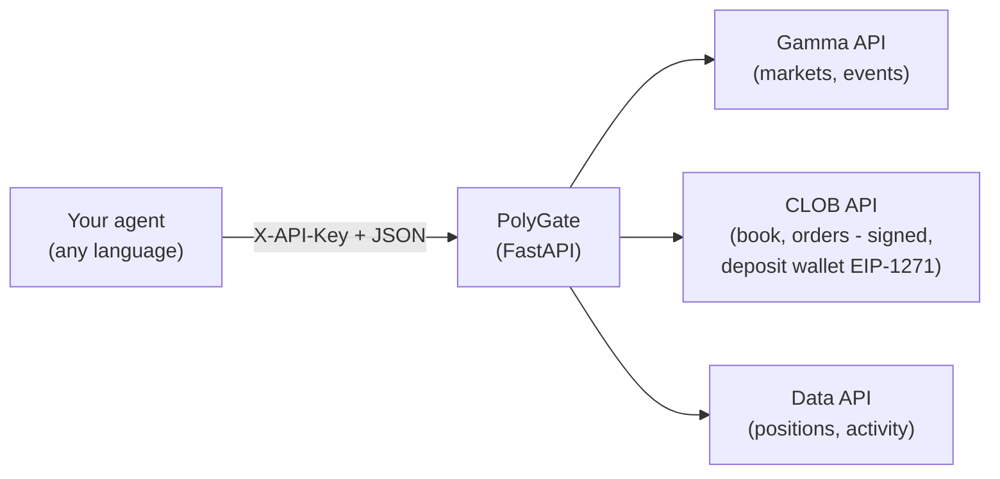

# PolyGate

**PolyGate** is a small, opinionated REST gateway that puts Polymarket's Gamma,
CLOB, and Data APIs behind one authenticated HTTP service - so a trading agent,
whether algorithmic or LLM-driven, can start trading on
[Polymarket](https://polymarket.com) without wrestling with SDKs, order signing,
or on-chain plumbing. Your agent just speaks JSON over HTTP, in **any language**.

- **Language-agnostic** - your agent talks to a local REST API, not a Python SDK.
- **One account model** - the modern Polymarket **deposit wallet** (EIP-1271,
  signature type 3).
- **Polymarket-native** - no on-chain setup, no token allowances, no separate RPC.
  Fund your account on polymarket.com and trade; all orders, fills, and history
  show up on your normal Polymarket account.

> This is an MVP: it supports the deposit-wallet flow Polymarket uses today, and
> nothing else.

## How it works



Trading on Polymarket involves two addresses, and you provide both:

- **Your wallet** (`PRIVATE_KEY`) - an ordinary Ethereum keypair, the same kind
  MetaMask manages (often called an *EOA*, "externally owned account"). Its
  private key **signs** your orders. If you already trade on Polymarket with
  MetaMask (or another wallet), that wallet *is* this one - just export its
  private key. You do not need a new wallet.
- **Your deposit wallet** (`FUNDER_ADDRESS`) - the account Polymarket provisions
  for you that actually **holds your USDC** and is the order maker. Polymarket
  validates your signature against it on-chain (EIP-1271). You never get a
  separate key for it; your wallet above controls it.

This service only **reads market/account data** and **places/cancels orders**. It does not manage your wallet, does not handle deposits or withdrawals, and does not sign any transactions other than orders, and does not provide any algorithmic trading logic. It is a thin, secure, abstraction layer on top of Polymarket's APIs so you can build your own trading agent in any language.

## Setup

### 1. Get the code and install

Requires Python 3.11+.

```bash
git clone https://github.com/ilmari99/polygate.git
cd polygate
python -m venv .venv && source .venv/bin/activate
pip install .
```

This installs the service and the `polygate` server command.

### 2. Configure your account

You need a wallet private key and your Polymarket deposit address.

- **Already on Polymarket?** Copy [.env.example](.env.example) to `.env` and fill
  in `PRIVATE_KEY` (export it from your wallet) and `FUNDER_ADDRESS`.
- **Starting fresh?** Run the generator - it creates a new wallet and a ready
  `.env` (with a `PLATFORM_API_KEY` already set), then connect that wallet on
  polymarket.com to provision your deposit wallet:

  ```bash
  python scripts/generate_wallet.py
  ```

Find your `FUNDER_ADDRESS` on polymarket.com under **Settings → Profile → Address** - it is
the address shown there. It is different from your wallet address.

Then set `PLATFORM_API_KEY` to any random value (it guards the account-only
endpoints of this REST API).

That is all the setup you need: the **CLOB credentials are derived automatically
from your wallet key the first time the server starts**, and saved back to
`.env`.

### 3. Run

```bash
polygate
```

The API listens on `http://127.0.0.1:8000`, with interactive docs at
`http://127.0.0.1:8000/docs`. Orders are **real** once the server is running and
your account is funded.

## Configuration

All configuration is environment-driven; see [.env.example](.env.example).

| Variable           | Required | Description                                                              |
| ------------------ | :------: | ------------------------------------------------------------------------ |
| `PRIVATE_KEY`      |   yes    | Private key of the wallet that signs your orders. **Keep secret.**       |
| `FUNDER_ADDRESS`   |   yes    | Your Polymarket deposit address.                                         |
| `PLATFORM_API_KEY` |   yes    | Shared secret for this REST API. Sent as the `X-API-Key` header.         |
| `CLOB_API_KEY`     |   auto   | Auto-derived from your wallet key at startup.                            |
| `CLOB_SECRET`      |   auto   | Auto-derived from your wallet key at startup.                            |
| `CLOB_PASSPHRASE`  |   auto   | Auto-derived from your wallet key at startup.                            |
| `HOST` / `PORT`    |    no    | Server bind address (default `127.0.0.1:8000`).                          |
| `LOG_LEVEL`        |    no    | Logging level (default `INFO`).                                          |

The server refuses to start without `PLATFORM_API_KEY` (it protects the account
endpoints) or without a wallet; the CLOB credentials it needs are derived
automatically on first start.

## Using the API

A trading agent drives everything over HTTP. The flow is always the same: read
market data, decide, then place orders.

### Authentication

Public **market-data** and **research** endpoints (markets, events, order book,
prices, search, comments, holders) need no credentials. Endpoints that touch your
**account** - the whole `/portfolio` group, the `/orders` and `/trades` listings,
the trading actions, and `/config` - require your platform secret in the
`X-API-Key` header. `GET /health` is always public.

```bash
# public - no key needed
curl -s localhost:8000/markets

# account - key required
curl -s localhost:8000/portfolio/positions -H "X-API-Key: $PLATFORM_API_KEY"
```

### Response shape

**Data endpoints** wrap their payload so your agent can reason about staleness -
it, not the platform, controls the polling frequency:

```json
{
  "data": { "...": "upstream payload" },
  "fetched_at": "2026-06-15T12:00:00Z",
  "source": "gamma"
}
```

**Action endpoints** (`POST /orders`, cancels) return the result directly, e.g.:

```json
{ "simulated": false, "success": true, "order_id": "0xabc...", "status": "matched" }
```

Errors always come back as `{ "error": "<code>", "detail": "<message>" }` with an
appropriate HTTP status.

### A typical agent loop

1. `GET /markets?active=true&closed=false` - find a market; read its
   `clobTokenIds` (a JSON array of the Yes/No outcome token ids).
2. `GET /midpoint/{token_id}` (or `/orderbook/{token_id}`, `/price/{token_id}`) -
   read the current market for the outcome you care about.
3. Decide your price and size.
4. `POST /orders` - place the order.
5. `GET /orders?market={condition_id}` and `GET /trades` - track open orders and
   fills; `GET /portfolio/positions` and `/portfolio/value` for your book.

[examples/sample_agent.py](examples/sample_agent.py) is a runnable, dependency-free
reference implementation of exactly this loop.

### Placing an order

```bash
curl -s -X POST localhost:8000/orders \
  -H "X-API-Key: $PLATFORM_API_KEY" -H "Content-Type: application/json" \
  -d '{
    "token_id": "713210456792522125946263855327069127503327285719425322896313793124555839925",
    "side": "BUY",
    "size": 5,
    "price": 0.42,
    "order_type": "GTC"
  }'
```

| Field        | Required | Notes                                                              |
| ------------ | :------: | ------------------------------------------------------------------ |
| `token_id`   |   yes    | CLOB token id of the outcome (Yes or No), from `clobTokenIds`.     |
| `side`       |   yes    | `BUY` or `SELL`.                                                    |
| `size`       |   yes    | Number of outcome shares (> 0).                                    |
| `price`      | for GTC/GTD | Limit price in `(0, 1)`. Also required for `FOK`/`FAK`.         |
| `order_type` |    no    | `GTC` (default), `GTD`, `FOK`, `FAK` (see below).                  |
| `expiration` | for GTD  | Unix seconds.                                                      |
| `tick_size`  |    no    | Auto-detected from the market if omitted.                          |
| `neg_risk`   |    no    | Auto-detected from the market if omitted.                          |

Order types: `GTC` good-til-cancelled limit, `GTD` good-til-date (needs
`expiration`), `FOK` fill-or-kill, `FAK` fill-and-kill. `FOK`/`FAK` are
marketable orders and still need an explicit limit `price`.

## API reference

Market-data and research endpoints are public. Portfolio, trading, and `/config`
require `X-API-Key`; `GET /health` is always public.

### System
| Method | Path      | Description                          |
| ------ | --------- | ------------------------------------ |
| GET    | `/health` | Liveness + status (no auth).         |
| GET    | `/config` | Secret-free configuration summary.   |

### Market data
| Method | Path                          | Description                       |
| ------ | ----------------------------- | --------------------------------- |
| GET    | `/markets`                    | List markets (filters + `slug`).  |
| GET    | `/markets/{condition_id}`     | Single market.                    |
| GET    | `/events`                     | List events.                      |
| GET    | `/tags`                       | List tags.                        |
| GET    | `/orderbook/{token_id}`       | Full CLOB order book.             |
| GET    | `/price/{token_id}`           | Best book price per side: `?side=BUY` = best **bid**, `?side=SELL` = best **ask**. |
| GET    | `/midpoint/{token_id}`        | Order-book midpoint.              |
| GET    | `/spread/{token_id}`          | Bid/ask spread.                   |
| GET    | `/last-trade-price/{token_id}`| Last traded price.                |
| GET    | `/prices-history/{token_id}`  | Historical prices.                |

### Research
| Method | Path                        | Description                                      |
| ------ | --------------------------- | ------------------------------------------------ |
| GET    | `/search`                   | Full-text search over events/markets (`?q=`).    |
| GET    | `/comments`                 | Event comments (`?event_id=` numeric event id).  |
| GET    | `/holders/{condition_id}`   | Top holders per outcome token.                   |

### Portfolio
| Method | Path                   | Description                                 |
| ------ | ---------------------- | ------------------------------------------- |
| GET    | `/portfolio/positions` | Open positions (Data API).                  |
| GET    | `/portfolio/value`     | Current portfolio value.                    |
| GET    | `/portfolio/balance`   | Collateral or token balance (`?token_id=`). |
| GET    | `/activity`            | Account activity feed.                      |
| GET    | `/orders`              | Open orders (`?market=` / `?asset_id=`).    |
| GET    | `/trades`              | Trade history.                              |

### Trading
| Method | Path                        | Description             |
| ------ | --------------------------- | ----------------------- |
| POST   | `/orders`                   | Place an order.         |
| POST   | `/orders/cancel-all`        | Cancel all open orders. |
| POST   | `/orders/{order_id}/cancel` | Cancel one order.       |

## Development

```bash
pip install ".[dev]"
pytest -q
```

The suite runs fully offline (HTTP is mocked). Tests exercise a `DRY_RUN`
developer switch that simulates orders without signing or sending them; it is a
testing aid and off by default.

## Safety

- Treat `.env` as a credential. It is gitignored; keep it `chmod 600` and back up
  your `PRIVATE_KEY`. Losing it loses access to the account; leaking it risks your
  funds.
- The REST API is only as private as `PLATFORM_API_KEY`. Bind to `127.0.0.1`
  (the default) unless you front it with TLS and proper auth.

## License

MIT - see [LICENSE](LICENSE).
