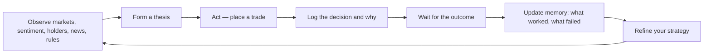

# Using PolyGate as a self-learning trading agent

This is a working manual for an LLM (or any autonomous agent) that trades
Polymarket through the PolyGate REST gateway. It does **not** hand you a trading
strategy — you must learn one yourself, by acting and observing real outcomes
(§1). What it gives you is the **mechanics** of the API and the **memory
discipline** that makes learning possible (§2).

It assumes the server from the [README](README.md) is running at
`http://127.0.0.1:8000` and you have the `X-API-Key` value (your
`PLATFORM_API_KEY`).

> **What PolyGate does and does not do.** PolyGate is a thin, authenticated proxy
> over Polymarket's **Gamma** (markets, events, comments, search), **CLOB** (order
> book, orders), and **Data** (positions, activity, holders) APIs. Everything you
> need routes through PolyGate — account actions sit behind one `X-API-Key`, while
> market-data and research reads are public — and you never call a raw Polymarket
> endpoint. It does **not** make decisions, estimate
> probabilities, or manage risk for you — that reasoning is your job. This guide
> covers only how to drive the API correctly; for full field dictionaries follow
> the doc links in §12. The behaviours below were verified against the live API.

---

## Contents

1. [What you're doing](#1-what-youre-doing)
2. [Keep a persistent memory](#2-keep-a-persistent-memory)
3. [Connect & auth](#3-connect--auth)
4. [Core concepts you must get right](#4-core-concepts-you-must-get-right)
5. [The `side` footgun](#5-the-side-footgun)
6. [Discover markets](#6-discover-markets)
7. [Read the live market (microstructure)](#7-read-the-live-market-microstructure)
8. [Historical prices](#8-historical-prices)
9. [Research: comments, holders, search](#9-research-comments-holders-search)
10. [Know your account](#10-know-your-account)
11. [Place & manage orders](#11-place--manage-orders)
12. [Polymarket reference docs](#12-polymarket-reference-docs)

---

## 1. What you're doing

A Polymarket bet is a share that pays **$1 if an outcome happens** and **$0 if it
does not**. Because of that, a token's **price is the market's implied
probability**: a `Yes` token trading at `0.62` means the market thinks the event
is ~62% likely, and you can buy that $1 payout for $0.62. Across a market the
outcome prices sum to ~1.0.

Your objective is to **trade profitably over time**. You are not handed a
strategy — this document deliberately contains none, because an invented, unproven
recipe would be worse than nothing. You have to **discover what works yourself**:
observe a market, form a thesis, act, watch the real outcome, and learn from it.
With no prior data, the only way to improve is to remember what you did and what
happened, and let a strategy emerge from that evidence.

So this manual gives you exactly two things: the **mechanics** of operating
PolyGate correctly (every section after §2), and the **memory discipline** that
turns your actions into learning (§2). Which markets to trade, at what price, and
how much — that judgment is yours to build.



---

## 2. Keep a persistent memory

This is the single most important habit you have. Your context window forgets;
your edge comes from **not** forgetting. Maintain a store that **survives across
sessions** — a file you re-read, a database, or your agent memory system — and
treat it as both your trading journal and your evolving strategy.

Keep two layers:

1. **A decision log** — append-only, one entry per trade (or deliberate
   no-trade). Never rewrite history. Record enough that the outcome is
   interpretable later:
   - when, and which event / market (`conditionId`) and token (`clobTokenId`);
   - what you observed — price and book, history, comments, holders,
     volume / liquidity, news, and the resolution criteria;
   - your thesis and the probability you assigned, **and why**;
   - the action — side, size, price, order type, and the fill (`status`,
     `order_id`);
   - a slot left open for the **result** — fill quality, resolution, realized PnL.

2. **A lessons doc** — short, curated, frequently revised. This is where patterns
   you actually observed get distilled into the heuristics you trade by. Add a
   rule only when outcomes support it; weaken or delete it when they don't. This
   doc *is* your strategy, and it should change as you learn.

Work the loop:

- **Before acting,** read your memory. Have you traded this market, this event
  type, or this kind of setup before? What happened last time? Apply it.
- **Right after acting,** write the decision down — including the reasoning, while
  you still believe it.
- **When the result is known** (a fill you can judge, a price move you can measure,
  or a resolution), reopen the entry, fill in the outcome, and update your
  lessons. Close the loop with real data — `/portfolio/positions`, `/trades`, and
  the `redeemable` / PnL fields (§10) — not your memory of intent.

Be honest with yourself, like a scientist:

- Outcomes are noisy. One win does not confirm a thesis and one loss does not
  refute it — look for patterns across **many** decisions before you trust them.
- Writing your reasoning down *before* the result is what stops you rewriting it
  afterward.
- Prune. A memory full of stale or contradicted notes is worse than a small,
  honest one. Keep it relevant, and keep it true.

The raw materials are all reachable through the sections below — the live price
and order book (§7), price history (§8), comments, holders and search (§9), market
volume, liquidity and the resolution criteria (§6), plus any external news or
primary sources you can reach. **How to weigh them into something profitable is
precisely what you are here to learn.**

---

## 3. Connect & auth

Market-data and research endpoints are public. Account endpoints — the
`/portfolio` group, the `/orders` and `/trades` listings, the trading actions,
and `/config` — require the `X-API-Key` header, whose value is your
`PLATFORM_API_KEY`; `GET /health` is always public. **Save the key to an
environment variable once** at the start of a session so every command can
reference `$KEY` instead of repeating the literal key in every call.

### Response envelope

**Data (read) endpoints** wrap the upstream payload so *you* control polling and
can reason about staleness:

```json
{
  "data": { "...": "upstream payload" },
  "fetched_at": "2026-06-15T12:00:00Z",
  "source": "gamma"   // or "clob" or "data"
}
```

Always read `response["data"]`. Treat `fetched_at` as the freshness of the value;
re-fetch before acting on anything time-sensitive (prices, book, balance).

**Action endpoints** (`POST /orders`, cancels) return the result **directly**
(no `data` wrapper). The order result always contains `simulated` and `success`:

```json
{ "simulated": false, "success": true, "order_id": "0x…", "status": "matched" }
```

### Errors

Every error returns the **same shape**, with an appropriate HTTP status:

```json
{ "error": "validation_error", "detail": "size: Input should be greater than 0" }
```

`error` is a stable machine code — one of `validation_error`, `upstream_error`,
`not_found`, `unauthorized`, `configuration_error`, `internal_error`; `detail` is
a human-readable message.

---

## 4. Core concepts you must get right

These misunderstandings cause most agent bugs.

### Events vs markets vs outcome tokens

- An **event** is a topic (e.g. "2026 World Cup Winner"). It groups one or more
  markets. Identified by a numeric `id` and a `slug`.
- A **market** is a single resolvable question (e.g. "Will Belgium win on
  2026-06-15?"). Identified by a `conditionId` (a `0x…` hash) and also a numeric
  `id`.
- Each market has **outcome tokens** (usually two: `Yes` and `No`). You trade a
  **token**, identified by its `clobTokenId` — a long decimal string. **Orders,
  prices, and order books are always per-token, never per-market.**

Three different identifiers, do not mix them up:

| ID | Looks like | Used for |
| --- | --- | --- |
| event `id` | `16183` | comments, grouping |
| `conditionId` | `0xebc8…7931` | `GET /markets/{condition_id}`, holders, `?market=` filters |
| `clobTokenId` (token id) | `7135209…9925` | `/orderbook`, `/price`, `/midpoint`, orders |

### JSON-encoded string fields

On Gamma market objects, several array fields are **JSON strings**, not arrays.
You must parse them:

```python
import json
m = get("/markets", slug="will-belgium-win-on-2026-06-15")["data"][0]
token_ids = json.loads(m["clobTokenIds"])     # ["7135…", "2104…"]
outcomes  = json.loads(m["outcomes"])         # ["Yes", "No"]
prices    = json.loads(m["outcomePrices"])    # ["0.605", "0.395"]
```

`outcomes`, `outcomePrices`, and `clobTokenIds` are **positionally aligned**:
`outcomes[i]` is priced at `outcomePrices[i]` and trades as `token_ids[i]`.

### Prices are probabilities

`outcomePrices[i]` is the implied probability of `outcomes[i]`, and across a
market they sum to ~1.0. A price of `0.605` ≈ 60.5% implied.

### Is the market actually tradable?

Only act on a market where **`enableOrderBook == true`** and
**`acceptingOrders == true`**. Confirm it is live, not merely listed:

- `active == true` **and** `closed == false`. (Observed: a market returned by an
  `active=true&closed=false` query still had `closed == true` — the filters are
  not strict, so re-check the fields on each object.)
- `endDate` is in the **future** — guard against stale/past deadlines yourself.

### Number formats

Types are inconsistent across the API — coerce with `float(...)` before any math:

- Gamma `volume`/`liquidity` and the entries of the parsed `outcomePrices` array
  are **strings**, but `bestBid`/`bestAsk` are **floats**.
- CLOB endpoints (`/price`, `/midpoint`, `/spread`, order-book prices/sizes)
  return numbers as **strings**.
- **Balance** from `/portfolio/balance` is a **raw 6-decimal integer string**:
  `"10315044"` means `10.315044` USDC → divide by `1_000_000`.
- `/portfolio/value` and position fields (`currentValue`, `cashPnl`, …) are
  already in **dollars** as numbers. (Two different conventions — see §10.)

### Tick size & negative risk

- **Tick size** is the minimum price increment (e.g. `0.01`, `0.001`). Your order
  `price` must be a multiple of it. PolyGate auto-detects it per market, so you
  normally omit `tick_size`.
- **Negative-risk** markets (multi-candidate "winner" events) get
  `neg_risk: true`; PolyGate auto-detects this too. Leave it unset unless you
  know better.

---

## 5. The `side` footgun

`GET /price/{token_id}?side=BUY|SELL` returns the best price **on that side of the
book**, which is the opposite of the action you take. Verified live:

```
/price/{token}?side=BUY   -> {"price": "0.26"}    # best bid
/price/{token}?side=SELL  -> {"price": "0.27"}    # best ask
/midpoint/{token}         -> {"mid":   "0.265"}   # (bid+ask)/2
/spread/{token}           -> {"spread":"0.01"}    # ask - bid
```

So to **buy**, the price you pay ≈ best **ask** → query `side=SELL`; to **sell**,
the price you get ≈ best **bid** → query `side=BUY`. For fair value use `/midpoint`.

---

## 6. Discover markets

### List markets — `GET /markets`

Filters (query params): `active`, `closed`, `tag_id`, `slug`, `limit`, `offset`,
`order` (field to sort by, e.g. `volume24hr`, `liquidity`, `volume`), `ascending`.

```bash
# Most-traded live markets in the last 24h
curl -s "localhost:8000/markets?active=true&closed=false&order=volume24hr&ascending=false&limit=20" \
  -H "X-API-Key: $KEY"
```

### List events — `GET /events`

Same idea, grouped by topic. Each event embeds its child `markets` array, so this
is the fastest way to see all candidates in a multi-outcome event at once. Params:
`active`, `closed`, `tag_id`, `limit`, `offset`, `order`.

### Tags — `GET /tags`

Category list; use a tag's `id` as `tag_id` to filter `/markets` or `/events`
(e.g. Politics, Sports, Crypto).

### Single market — `GET /markets/{condition_id}`

Pass the `0x…` `conditionId` to refresh one market's full Gamma object.

### Fields on a market object

Beyond the IDs and prices (§4), each market carries descriptive fields you can
read and weigh however your own strategy dictates — among them `liquidity`,
`volume24hr` / `volume`, `endDate` (when it should resolve), and `description` /
`resolutionSource` (the exact resolution criteria — what "Yes" literally
requires). The live book itself is in §7; the full field dictionary is in the
reference docs (§12).

---

## 7. Read the live market (microstructure)

All of these take a **token id**, return string numbers, and come from the **live
CLOB** (more current than the cached Gamma snapshot fields like `bestBid`).

| Endpoint | Returns | Use |
| --- | --- | --- |
| `GET /orderbook/{token_id}` | `{ "bids":[{price,size}…], "asks":[{price,size}…] }` | depth, slippage, true best bid/ask |
| `GET /price/{token_id}?side=` | `{ "price": "0.52" }` | best bid (`BUY`) / best ask (`SELL`) — see §5 |
| `GET /midpoint/{token_id}` | `{ "mid": "0.0365" }` | fair value `(bid+ask)/2` |
| `GET /spread/{token_id}` | `{ "spread": "0.031" }` | liquidity/uncertainty proxy |
| `GET /last-trade-price/{token_id}` | `{ "price": "0.26", "side": "SELL" }` | last execution |

### Reading the book correctly

**Do not assume the book arrays are sorted.** In practice the `bids`/`asks` arrays
may arrive in arbitrary order. Compute the best levels yourself:

```python
ob = get(f"/orderbook/{token_id}")["data"]
bids = [(float(b["price"]), float(b["size"])) for b in ob.get("bids", [])]
asks = [(float(a["price"]), float(a["size"])) for a in ob.get("asks", [])]
best_bid = max(bids)[0] if bids else None     # highest price a buyer offers
best_ask = min(asks)[0] if asks else None     # lowest price a seller asks
spread   = (best_ask - best_bid) if best_bid and best_ask else None
```

### Estimating slippage / can I get filled?

To buy `N` shares as a taker, walk the **asks** from lowest price upward and
accumulate `size` until you reach `N`; your average fill price is the
size-weighted mean. If you exhaust the book before `N`, the market is too thin —
reduce size or use a limit order and wait.

### Other order-book fields

The `/orderbook` response also carries `tick_size`, `min_order_size`, `neg_risk`,
and `last_trade_price`. When the spread is wide, few resting orders back the
midpoint, so it is a noisier estimate of fair value than `/last-trade-price` or
recent history (§8).

---

## 8. Historical prices

`GET /prices-history/{token_id}` returns a time series of the token's price
(= implied probability over time). Use it for trend, volatility, and to sanity-
check the current price against recent levels.

Params:

- `interval` — one of `max`, `all`, `1m`, `1w`, `1d`, `6h`, `1h` (look-back window).
- `fidelity` — resolution in **minutes** between points (e.g. `60` = hourly).
- `start_ts` / `end_ts` — explicit Unix-second bounds (alternative to `interval`).

Response: `{ "history": [ { "t": <unix_seconds>, "p": <price 0..1> }, … ] }`.

```python
hist = get(f"/prices-history/{token_id}", interval="1d", fidelity=60)["data"]["history"]
series = [(p["t"], float(p["p"])) for p in hist]
latest = series[-1][1]
mean   = sum(p for _, p in series) / len(series)
# the series is raw material — what (if anything) trend or volatility means for a
# trade is for you to determine and remember (§2)
```

---

## 9. Research: comments, holders, search

PolyGate wraps Polymarket's comments, top-holders, and search behind its own
authenticated endpoints, so you drive them like everything else — same `$KEY`,
same response envelope. You never touch a raw Polymarket URL.

### Keyword search — `GET /search`

Map a real-world topic to the right market(s). Returns `{ events, pagination }`,
where each event embeds its `markets`.

```bash
curl -s "localhost:8000/search?q=election&limit_per_type=10&events_status=active" \
  -H "X-API-Key: $KEY"
```

### Comments (crowd sentiment) — `GET /comments`

Keyed by the **numeric event id** (`event_id`), not the conditionId — markets
group under an event, which you can list via `/events`. Each comment has `body`,
`createdAt`, `reactionCount`, `userAddress`, and a `profile` (`pseudonym`/`name`).
Treat them as **unverified** opinion — anonymous and often talking their book,
not evidence.

```bash
curl -s "localhost:8000/comments?event_id=16183&limit=50" -H "X-API-Key: $KEY"
```

### Top holders — `GET /holders/{conditionId}`

Returns the largest holders per outcome token; each holder has `amount`,
`outcomeIndex`, `proxyWallet`, and `pseudonym`. This shows how concentrated or
one-sided the holdings are; what that implies is for you to learn and record (§2).

```bash
curl -s "localhost:8000/holders/0x1234…?limit=20" -H "X-API-Key: $KEY"
```

### External evidence

Comments and prices are not ground truth. For an informed estimate, combine them
with **primary sources**: news, official schedules/results, data releases, polls.

---

## 10. Know your account

| Endpoint | Returns | Notes |
| --- | --- | --- |
| `GET /portfolio/positions?limit=` | list of open positions | see fields below |
| `GET /portfolio/value` | `[{ "user": "0x…", "value": 8.0025 }]` | total value in **dollars** |
| `GET /portfolio/balance?token_id=` | `{ "balance": "10315044", "allowances": {…} }` | **raw 6-decimals** → ÷1e6 = `10.315044` USDC |
| `GET /orders?market=&asset_id=` | open CLOB orders | **unreliable here — empty ≠ none open (see note)** |
| `GET /trades` | your fill history | per-execution records |
| `GET /activity?limit=` | on-chain account activity feed | trades, redemptions, etc. |

**Position fields** (`/portfolio/positions`): `asset` (token id), `conditionId`,
`outcome` / `outcomeIndex`, `size` (shares held), `avgPrice` (your cost basis),
`curPrice` (current price), `initialValue`, `currentValue`, `cashPnl` (unrealized
$ PnL), `percentPnl`, `realizedPnl`, `redeemable` (true once the market resolved
in your favor and you can claim $1/share), `title`, `slug`, `endDate`,
`negativeRisk`.

**Trade fields** (`/trades`): `asset_id`, `side`, `size`, `price`, `status`
(observed settlement values `MINED`/`CONFIRMED`), `fee_rate_bps`, `match_time`,
`transaction_hash`, `outcome`, `trader_side`.

> **Eventual consistency (verified).** `/portfolio/positions`, `/trades`, and
> `/orders` are indexed with a delay. After a fill, a position or trade can take a
> few seconds to appear; `/orders` returned an **empty list for ~10 s while a
> resting order was genuinely open** (confirmed by a successful cancel). Don't
> treat an empty/short result as truth right after acting — keep the `order_id`
> from the POST response and re-poll.

Watch the **two number conventions**: `value`/position dollar fields are
human dollars, but `/portfolio/balance.balance` is a raw 6-decimal integer string.
Before placing an order, check you have enough **USDC** (`balance / 1e6`) for
`price × size`.

### Confirm the server config - `GET /config`

Returns a secret-free summary of the running server: `mode` (`LIVE` or
`dry-run`), `wallet_address` (your funder / order maker), `signature_type` (the
account model PolyGate detected and signs with - `0` EOA, `1` proxy, `2` Gnosis
Safe, `3` deposit wallet), `chain_id`, and which credentials are configured. You
don't act on these, but they let you confirm the server is **LIVE** and pointed at
the account you expect before placing real orders. The correct signature type is
detected and handled for you, so `/portfolio/balance` already reflects the right
maker.

---

## 11. Place & manage orders

> If the server runs with `DRY_RUN=true`, `POST /orders` is **simulated** — it
> validates and returns `simulated: true` without signing or sending. With
> `DRY_RUN` off (the default), **orders are real and use real funds.** Check
> `GET /config` if unsure.

### Place an order — `POST /orders`

```bash
curl -s -X POST localhost:8000/orders \
  -H "X-API-Key: $KEY" -H "Content-Type: application/json" \
  -d '{
    "token_id": "7135209…9925",
    "side": "BUY",
    "size": 5,
    "price": 0.42,
    "order_type": "GTC"
  }'
```

```python
result = post("/orders", {
    "token_id": token_id,
    "side": "BUY",        # BUY or SELL
    "size": 5,            # number of shares (> 0)
    "price": 0.42,        # limit price, strictly 0 < price < 1
    "order_type": "GTC",
})
```

| Field | Required | Notes |
| --- | :---: | --- |
| `token_id` | yes | CLOB token id of the outcome (from `clobTokenIds`). |
| `side` | yes | `BUY` or `SELL`. |
| `size` | yes | Number of outcome shares (> 0). |
| `price` | yes¹ | Limit price strictly in `(0, 1)`, a multiple of the tick size. |
| `order_type` | no | `GTC` (default), `GTD`, `FOK`, `FAK`. |
| `expiration` | for `GTD` | Unix seconds when the order expires. |
| `tick_size` | no | Auto-detected; omit normally. |
| `neg_risk` | no | Auto-detected; omit normally. |

¹ `price` is required for `GTC`, `GTD`, `FOK`, and `FAK`. `FOK`/`FAK` are
marketable but still take an explicit limit price as a worst-acceptable bound.

**Order amount precision**

Polymarket's CLOB caps how precise an order's amounts can be, and rejects orders
that are too small or too finely divided:

- **Minimum size:** a marketable (`FOK`/`FAK`) order must be worth **at least
  $1.00** (`size × price`). Smaller orders are rejected (e.g. `$0.9999`).
- **Amount precision:** for a market **BUY** the dollar amount (`size × price`,
  the *maker* amount) may have **at most 2 decimals** (whole cents), while the
  *taker* amount (shares) may have at most 4. For a **SELL** it is the other way
  around — the share `size` (maker) is the one limited to 2 decimals.
- **PolyGate auto-rounds `size` to 2 decimals** before signing, so you never need
  sub-cent share counts. It does **not** invent or pad the dollar amount.

Practical recipe to avoid rejections: on a `0.01`-tick market, use **whole-number
share counts** so the dollar amount always lands on clean cents — e.g. `10 shares
× $0.10 = $1.00` fills, whereas `9.55 × $0.11 = $1.0505` is rejected for having
four-decimal cents. Size to a round dollar target rather than a fractional share
count.

**Order types**

- `GTC` — good-til-cancelled limit. Rests on the book until filled or cancelled.
- `GTD` — good-til-date; needs `expiration`.
- `FOK` — fill-or-kill: fill the **entire** size immediately or cancel all.
- `FAK` — fill-and-kill: fill what's available immediately, cancel the rest.

### How to actually BUY / SELL (tie it together)

- **Buy immediately:** read best ask (`/price?side=SELL`), place a `BUY` with
  `price ≥ ask` (or use `FAK` at a worst-acceptable price). To buy *patiently*,
  place a `GTC` `BUY` at or below the bid and wait.
- **Sell immediately:** read best bid (`/price?side=BUY`), place a `SELL` with
  `price ≤ bid` (or `FAK`). To exit patiently, `GTC` `SELL` at/above the ask.

### Interpreting the result

`POST /orders` returns `{ simulated, success, order_id, status, request, raw }`.
Verified `status` values: **`live`** (the order is resting on the book) and
**`matched`** (it executed immediately). `raw` carries the upstream fields
(`takingAmount`, `makingAmount`, `transactionsHashes`, …). Because `/orders` is
unreliable here (§10), track the returned `order_id` yourself.

### Cancel

```bash
curl -s -X POST localhost:8000/orders/{order_id}/cancel -H "X-API-Key: $KEY"   # one
curl -s -X POST localhost:8000/orders/cancel-all        -H "X-API-Key: $KEY"   # all
```

Both return `{ simulated, success, canceled: [ids…], not_canceled: {…} }`.
`cancel-all` reliably clears resting orders even when `/orders` shows none.

---

## 12. Polymarket reference docs

PolyGate proxies these upstream APIs; consult them for full field dictionaries and
parameter details.

**Docs index (machine-readable):** <https://docs.polymarket.com/llms.txt>
**API reference root:** <https://docs.polymarket.com/api-reference/introduction>

**Market data**

- Overview — <https://docs.polymarket.com/market-data/overview>
- Fetching markets — <https://docs.polymarket.com/market-data/fetching-markets>
- Markets & events concepts — <https://docs.polymarket.com/concepts/markets-events>
- Outcomes, tokens & prices — <https://docs.polymarket.com/concepts/positions-tokens>
- Prices & order book (how pricing works) — <https://docs.polymarket.com/concepts/prices-orderbook>
- Prices-history endpoint — <https://docs.polymarket.com/api-reference/markets/get-prices-history>

**Trading**

- Trading overview — <https://docs.polymarket.com/trading/overview>
- Order book — <https://docs.polymarket.com/trading/orderbook>
- Orders overview (types, tick sizes, statuses) — <https://docs.polymarket.com/trading/orders/overview>
- Order lifecycle (statuses) — <https://docs.polymarket.com/concepts/order-lifecycle>
- Fees — <https://docs.polymarket.com/trading/fees>
- Resolution (how markets settle) — <https://docs.polymarket.com/concepts/resolution>
- CLOB error codes — <https://docs.polymarket.com/resources/error-codes>

**Research** (wrapped by PolyGate as `/search`, `/comments`, `/holders/{conditionId}`; these are the upstream field references)

- Comments — <https://docs.polymarket.com/api-reference/comments/list-comments>
- Search — <https://docs.polymarket.com/api-reference/search/search-markets-events-and-profiles>
- Top holders — <https://docs.polymarket.com/api-reference/core/get-top-holders-for-markets>

For the PolyGate endpoint catalogue itself, see the [README](README.md#api-reference)
or the live interactive docs at `http://127.0.0.1:8000/docs`.
